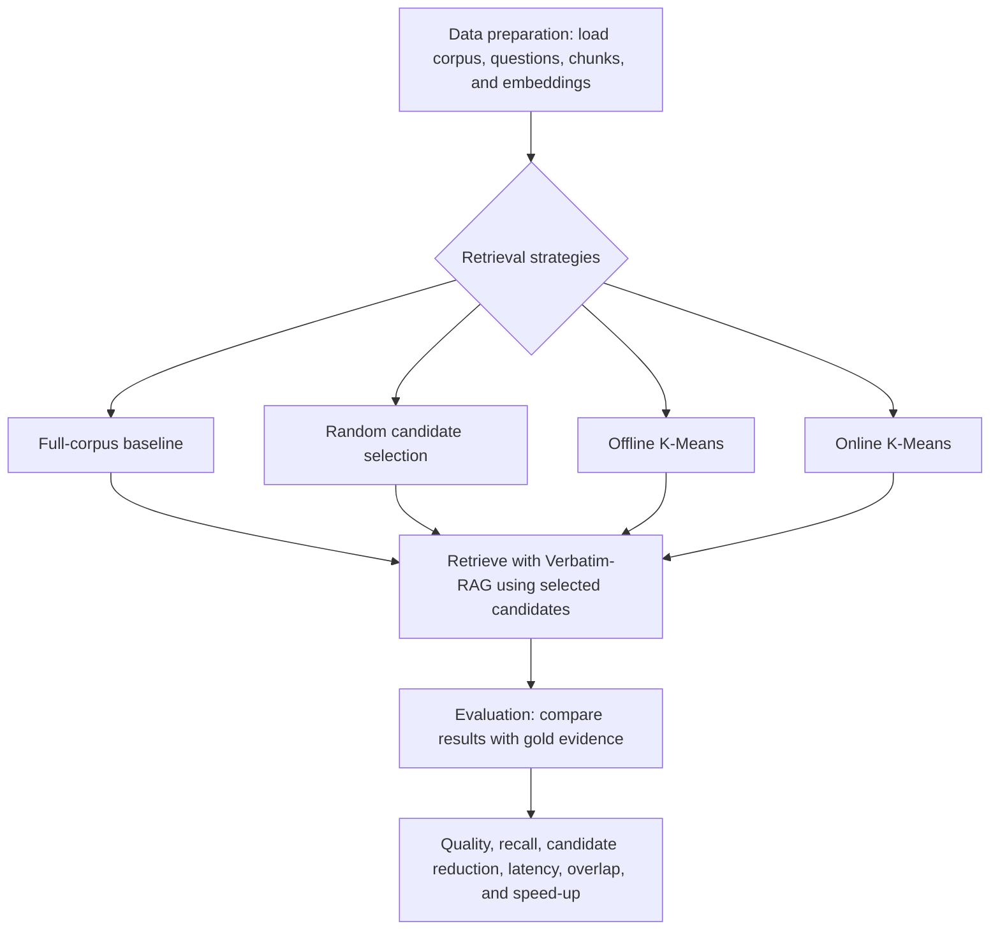

# VerbatimRAG with online clustering

## Environment Setup

Create and activate the conda environment:

```bash
conda env create -f environment.yml
conda activate verbatim-rag-onlineclustering
```

For the notebook, start Ollama and use a local model like `llama3.2:3b`.

## Reproducible pipeline

The experiment is split into independently runnable stages. All generated data is
stored under `data/`; evaluation output is stored under `results/`.

```bash
conda activate verbatim-rag-onlineclustering
python scripts/prepare_data.py --config configs/config.yaml
python scripts/create_embeddings.py --config configs/config.yaml
python scripts/run_evaluation.py --config configs/config.yaml

# or provide a readable experiment name
python scripts/run_evaluation.py --config configs/config.yaml --name k100_validation
```

## End-to-end pipeline

The following diagram shows how source data becomes evaluated retrieval results.
The baseline, random, offline K-Means, and online K-Means systems all share the
same final Verbatim-RAG scoring path; clustering only changes how candidate
chunks are selected before retrieval.



`prepare_data.py` downloads the configured ACL corpus and evaluation split,
chunks documents, and writes `data/processed/chunks.jsonl` and
`data/processed/evaluation.jsonl`. `create_embeddings.py` writes chunk and
query vectors under `data/embeddings/`. The evaluation runner first executes
full-corpus retrieval through `verbatim_rag.VerbatimIndex`, then routes queries
through fixed Online K-Means before invoking the same Verbatim-RAG query path
with a candidate filter. Each evaluation writes predictions and metrics as JSON
under a new timestamped experiment directory.

The preparation step uses the ACL `anthology_id` field and the same
`MarkdownChunkerProvider(min_chunk_size=500, max_chunk_size=5000)` settings used
by ACL-Verbatim. For validation development runs,
`data.include_evaluation_papers: true` ensures the selected corpus contains the
validation gold papers. Do not enable this for the held-out `test` split; use
the full corpus or an independently selected corpus for the final test.

Whenever `chunks.jsonl` is regenerated, embeddings must be regenerated before
evaluation. The runner checks that the number of embedding rows equals the
number of prepared chunks and stops with an actionable error otherwise.

The experiment uses an in-memory `verbatim-rag` vector store so persisted
embeddings can be reused without a separate Milvus database. Verbatim-RAG is
responsible for final query scoring; Online K-Means only supplies candidate IDs.

Each evaluation creates a new directory under `experiments/`, named with the
configured name and a UTC timestamp:

```text
experiments/k100_validation_YYYYMMDDTHHMMSSZ/
	config.yaml
	metadata.json
	baseline/{predictions.jsonl,metrics.json}
	random/{predictions.jsonl,metrics.json}
	offline_kmeans/{predictions.jsonl,metrics.json}
	online_kmeans/{predictions.jsonl,metrics.json}
	plots/*.png
```

The system matrix is controlled by `experiment.systems` in
`configs/config.yaml`. Available systems are `baseline`, `random`,
`offline_kmeans`, and `online_kmeans`. Metrics include Hit@1/3/5/10, routing
recall, candidate fraction/reduction, baseline overlap, mean/median/p95 total
and retrieval latency, plus the separate embedding, routing, candidate
construction, and retrieval timings. The generated plots cover quality and
latency versus candidate fraction, routing recall versus clusters searched,
baseline preservation, candidate reduction, cluster count by system, and
Verbatim-RAG retrieval speed-up versus the full-corpus baseline. Speed-up is
reported as `baseline latency / system latency`; values above `1.0` are faster
than baseline. Metrics also include mean latency saved in milliseconds and
median/p95 speed-up.

## Plot interpretation

All charts compare the configured systems: `baseline`, `random`,
`offline_kmeans`, and `online_kmeans`.

| Plot | What it shows | How to interpret it |
|---|---|---|
| `quality_vs_candidate_fraction.png` | Gold Hit@10 versus searched-corpus fraction | Prefer high Hit@10 with a low candidate fraction. |
| `latency_vs_candidate_fraction.png` | Verbatim-RAG retrieval latency after candidate selection | Lower bars indicate faster final retrieval. |
| `routing_recall_vs_clusters_searched.png` | Fraction of gold chunks whose cluster was selected | Higher bars mean the router is less likely to discard relevant evidence. `baseline` and `random` are not applicable. |
| `baseline_overlap_vs_candidate_fraction.png` | Overlap with the full-corpus baseline results | Higher overlap means the routed system preserves more of the original Verbatim-RAG behavior. |
| `candidate_reduction_by_system.png` | Percentage of the corpus excluded before final retrieval | Higher bars mean greater search-space reduction, but this must be read together with Hit@10. |
| `cluster_count_by_system.png` | Configured number of clusters | This is an experiment setting, not a quality score. |
| `retrieval_speedup_by_system.png` | Final Verbatim-RAG speed-up relative to baseline | `1.0x` is equal to baseline; values above `1.0x` are faster. |

The strongest result is not the system with the highest reduction alone. The
research trade-off is the combination of high gold recall, high baseline
overlap, meaningful candidate reduction, and speed-up. `routing_recall` should
be checked before `gold_hit_at_10`: low routing recall means the cluster router
discarded the evidence, while high routing recall with lower Hit@10 points to a
downstream Verbatim-RAG retrieval issue.


